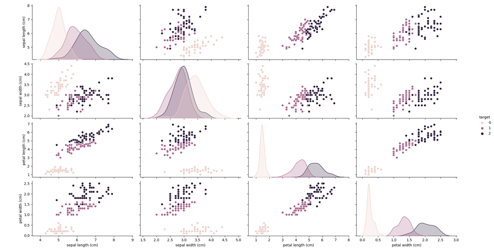
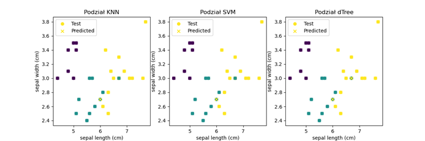

# DataAnalyzing_MachineLearning_Python_Example
Short example how to use data analyzing and ML in the analysis of structured information about irises.

# About
Code realizes exercise below:

## Exercise subject and objective
The objective of the exercise was to correctly classify the Iris dataset.
The Iris dataset contains information about three species of irises (Iris setosa, Iris versicolor, and Iris virginica) and four features (sepal length, sepal width, petal length, and petal width). 
The task is to classify the species based on these features. 

## Performed Tasks
- Imported the dataset for analysis from the iris library.
- Analyzed the imported data, checked the number of columns and rows.
- Visualized the data using the seaborn library.
- Splited the dataset into training and testing sets in a 4:1 ratio.
- Created and trained three different models using the training set, each using a different algorithm (choices: naive Bayes classifier, kNN, random forest, SVM, decision trees).
- Made predictions for the test data using each model.
- Printed classification reports for each model.
- Performed cross-validation and present the results.
- Visualized the classification of the test data.
- Compared the results and select the best model.

# 📚 Libraries 
<strong>SKLEARN</strong> - useful and robust library for machine learning in Python. 

# 🡓 Example Task
## Visualized the classification of the test data. (Split Test Data)

